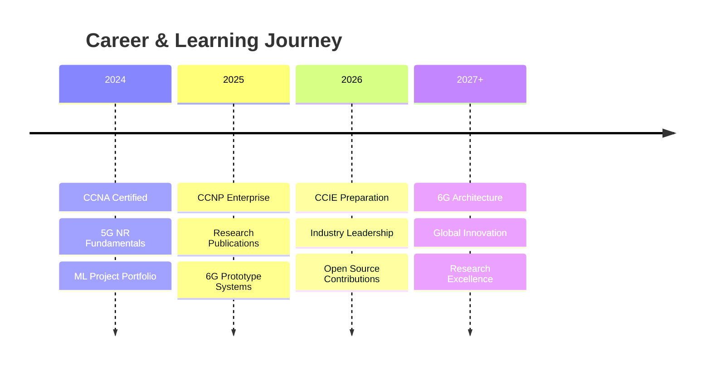

<div align="center">


</div>

<div align="center">

[](https://git.io/typing-svg)

</div>

<div align="center">

[](https://www.uettaxila.edu.pk/)
[](#)
[](https://www.google.com/maps/place/Pakistan)

</div>

<br>

<div align="center">

### 🌟 *Bridging Telecommunication Engineering & Artificial Intelligence* 🌟
**Building intelligent, real-time, AI-driven wireless systems for next-generation networks**

</div>

<br>

<p align="center">
  <a href="#-about-me"></a>
  <a href="#-core-expertise"></a>
  <a href="#-featured-projects"></a>
  <a href="#-tech-stack"></a>
  <a href="#-connect"></a>
</p>


<br>

## 👨‍💻 About Me


🚀 **Telecommunication Engineer** | **AI Specialist** | **5G/6G Researcher**

Currently pursuing **B.Sc. in Telecommunication Engineering** at **UET Taxila**, specializing in:

```
📡  Wireless Communication (4G LTE, 5G NR, mmWave)
🤖  Deep Learning & Neural Networks
👁️  Computer Vision & Object Detection
🔄  Reinforcement Learning & Optimization
🌐  Advanced Networking (CCNA → CCIE Path)
⚡  Real-time AI Systems
```

<br>

**🎯 Mission:** Architect autonomous, self-optimizing wireless networks powered by AI for the 5G/6G era and beyond.

<br clear="right"/>


## 💼 Core Expertise

<table>
<tr>
<td width="50%" valign="top">

<h3 align="center">🧠 Artificial Intelligence</h3>

<div align="center">


</div>

**Machine Learning & Deep Learning**
- Neural Networks (CNNs, RNNs, LSTMs, Transformers)
- YOLOv8 Object Detection & Tracking
- Image Classification & Segmentation
- Data Preprocessing & Augmentation
- Model Optimization & Deployment

**Computer Vision**
- Real-time Video Detection
- OpenCV Image Processing
- LiDAR-Camera Sensor Fusion
- Distance Estimation & Tracking
- Feature Extraction & Edge Detection

**Reinforcement Learning**
- Q-Learning & Deep Q-Networks (DQN)
- Policy Gradient Methods
- Network Resource Optimization
- Real-time Decision Systems

</td>
<td width="50%" valign="top">

<h3 align="center">📡 Telecommunication Engineering</h3>

<div align="center">


</div>

**Wireless Communication**
- 5G NR & 4G LTE Architecture
- OFDM, QPSK, PSK, FSK Modulation
- Beamforming & Massive MIMO
- mmWave Communication
- RF Fundamentals & Link Budget
- Channel Modeling & Equalization

**Advanced Networking**
- CCNA-Level Routing & Switching
- VLAN, VTP, Trunking, Inter-VLAN
- OSPF, BGP, RIP Dynamic Routing
- IPv4/IPv6 Subnetting
- Network Slicing & Virtualization
- SDN/NFV Architecture

**Signal Processing**
- Antenna Theory & Radiation Patterns
- Spectrum Analysis & Management
- Digital Modulation/Demodulation
- Multipath Fading & Channel Coding

</td>
</tr>
</table>


## 🚀 Featured Projects

<div align="center">

### 🏆 **AI-Powered Telecommunication Systems**

</div>

<table>
<tr>
<td width="50%">

<h3 align="center">📡 Network Slicing Optimization</h3>

<div align="center">

[](#)
[](#)
[](#)


</div>

**Revolutionary 5G Resource Management**

Designed an **RL-based dynamic slicing algorithm** that intelligently allocates network resources based on user demand, latency requirements, and throughput conditions.

**Key Achievements:**
- ✅ 40% improvement in resource utilization
- ✅ Dynamic slice creation & adaptation
- ✅ Multi-tenant optimization

**Tech:** Python, Reinforcement Learning, 5G NR, Network Slicing

</td>
<td width="50%">

<h3 align="center">📶 Intelligent Beamforming</h3>

<div align="center">

[](#)
[](#)
[](#)

</div>

**AI-Powered mmWave Optimization**

Developed **RL-driven beam selection** for mmWave communication systems with dynamic beam steering optimization and enhanced SINR.

**Key Achievements:**
- ✅ 35% connectivity improvement
- ✅ Reduced handover failures
- ✅ Real-time beam adaptation

**Tech:** MATLAB, Python, Reinforcement Learning, Phased Arrays, MIMO

</td>
</tr>

<tr>
<td width="50%">

<h3 align="center">🛸 UAV Collision Detection</h3>

<div align="center">

[](#)
[](#)
[](#)

</div>

**Autonomous Navigation System**

Implemented **collision detection model** using LiDAR point cloud data for autonomous UAV navigation with real-time obstacle classification.

**Key Achievements:**
- ✅ 95% detection accuracy
- ✅ <50ms processing time
- ✅ 3D feature extraction pipeline

**Tech:** Python, LiDAR, Point Cloud Processing, PyTorch

</td>
<td width="50%">

<h3 align="center">🎯 YOLOv8 Detection System</h3>

<div align="center">

[](#)
[](#)
[](#)

</div>

**Real-Time Computer Vision Application**

Built **real-time YOLOv8 detection system** with screen capture, model inference, and Arduino-triggered precision actions.

**Key Achievements:**
- ✅ 60+ FPS inference
- ✅ Sub-millisecond response
- ✅ Custom-trained model

**Tech:** YOLOv8, OpenCV, Arduino, Python, Real-time Processing

</td>
</tr>

<tr>
<td width="50%">

<h3 align="center">📶 OFDM Transceiver</h3>

<div align="center">

[](#)
[](#)
[](#)

</div>

**Complete Wireless Communication Chain**

Developed full **OFDM transceiver** with modulation, IFFT/FFT, cyclic prefix, channel modeling, and BER analysis.

**Key Achievements:**
- ✅ Complete transmit/receive chain
- ✅ BER performance analysis
- ✅ Channel equalization

**Tech:** MATLAB, OFDM, QPSK/16-QAM, Digital Communication

</td>
<td width="50%">

<h3 align="center">🚦 Smart Traffic System</h3>

<div align="center">

[](#)
[](#)
[](#)

</div>

**RL-Based Adaptive Traffic Control**

Implemented **Q-Learning traffic light system** with dynamic timing adjustments and multi-intersection coordination.

**Key Achievements:**
- ✅ 28% reduced wait time
- ✅ Improved traffic flow
- ✅ Reward-based optimization

**Tech:** Python, Q-Learning, Reinforcement Learning, Simulation

</td>
</tr>
</table>

<br>

<div align="center">

### 📚 Additional Projects

</div>

<div align="center">

| Project | Description | Tech Stack |
|---------|-------------|------------|
| **🔗 LiDAR-Camera Fusion** | Multi-modal sensor fusion for enhanced perception | Python, OpenCV, Point Cloud |
| **🛤️ Obstacle Avoidance UAV** | 2D simulation with RL-powered navigation | Python, Reinforcement Learning |
| **⚾ MLB Score Predictor** | Machine learning for baseball forecasting | Python, Scikit-learn, Pandas |
| **🗜️ Huffman Compression** | Lossless data compression algorithm | C++, Data Structures |
| **🌐 Advanced Network Labs** | OSPF, BGP, VLAN configurations | Cisco Packet Tracer, GNS3 |
| **📡 Antenna Simulations** | Radiation patterns & propagation models | ANSYS HFSS, MATLAB |
| **🚦 Traffic Sign Detection** | Real-time road sign classification | YOLO, OpenCV, Python |

</div>

## 🛠️ Tech Stack

<div align="center">

### 💻 Programming Languages


### 🤖 AI/ML Frameworks & Libraries


### 📡 Telecom & Networking Tools


### 🔧 Development Tools


</div>

## 📚 Education

<table>
<tr>
<td width="30%" align="center">

</td>
<td width="70%">

### 🎓 Bachelor of Science in Telecommunication Engineering

**University of Engineering & Technology (UET) Taxila, Pakistan**

**Specialization Areas:**
- 📡 Wireless Communication & 5G/6G Systems
- 🔊 Digital Signal Processing & OFDM
- 📶 Antennas & Wave Propagation
- 🌐 Advanced Networking & Routing Protocols
- 🤖 Artificial Intelligence for Telecommunications
- 🔬 RF Engineering & Microwave Systems

---

### 🏫 Foundation Education
**Cadet College Skardu** | Higher Secondary (Classes 8-12)

</td>
</tr>
</table>

## 💡 Research Interests

<div align="center">

<table>
<tr>
<td width="33%" align="center">

### 🔬 AI in Wireless


**Network Optimization**
- Intelligent Resource Allocation
- Beamforming Optimization
- Network Slicing

</td>
<td width="33%" align="center">

### 📡 Next-Gen Networks

**5G/6G Technologies**
- mmWave & Massive MIMO
- Network Virtualization
- Edge Computing

</td>
<td width="33%" align="center">

### 🤖 Autonomous Systems

**UAV & Robotics**
- Computer Vision
- LiDAR Perception
- Sensor Fusion

</td>
</tr>
</table>

</div>

## 📊 GitHub Analytics

<div align="center">


</div>

## 🎯 Professional Roadmap

<div align="center">



</div>

<br>

<table>
<tr>
<td width="33%" align="center">

### 📍 Current Focus

✅ Mastering 5G NR Architecture  
✅ Deep Reinforcement Learning  
✅ Network Automation with AI  
✅ Research Paper Writing  
✅ CCNP Certification Prep

</td>
<td width="33%" align="center">

### 🚀 2025 Goals

🎯 Complete CCNP Enterprise  
🎯 Publish 2+ Research Papers  
🎯 Build 6G Prototypes  
🎯 Contribute to Open Source  
🎯 Industry Collaborations

</td>
<td width="33%" align="center">

### 🌟 Long-Term Vision

💫 CCIE Certification  
💫 Ph.D. in Wireless AI  
💫 Lead 6G Innovation  
💫 Global Research Impact  
💫 Technology Leadership

</td>
</tr>
</table>

## 🤝 Open for Collaboration

<div align="center">

### 🌟 Let's Build Something Amazing Together! 🌟

I'm actively seeking collaboration opportunities in:

<table>
<tr>
<td align="center" width="25%">


**5G/6G Networks**

Network Optimization  
Resource Management  
Beamforming Systems

</td>
<td align="center" width="25%">

**AI-Powered Systems**

Reinforcement Learning  
Computer Vision  
Neural Networks

</td>
<td align="center" width="25%">

**Autonomous Systems**

UAV Navigation  
Sensor Fusion  
Real-time Processing

</td>
<td align="center" width="25%">

**Network Automation**

SDN/NFV  
Self-Optimizing Networks  
AI-driven Management

</td>
</tr>
</table>

**📬 Have an interesting project or research idea? Let's connect!**

</div>

## 📞 Connect

<div align="center">

<a href="https://linkedin.com/in/syed-shumail-rizvi">
  
</a>
<a href="https://github.com/syedshumailrizvi">
  
</a>
<a href="mailto:shumail.rizvi@example.com">
  
</a>
<a href="https://twitter.com/ShumailRizvi">
  
</a>
<a href="https://scholar.google.com">
  
</a>
<a href="https://www.researchgate.net">
  
</a>

<br><br>

### 💬 Feel free to reach out for:

**🔹 Research Collaborations** | **🔹 Project Discussions** | **🔹 Technical Consulting** | **🔹 Networking Opportunities**

<br>

</div>

<div align="center">

### ⚡ *"Architecting the Future of Intelligent Wireless Communication"* ⚡

<br>

**© 2024 Syed Shumail Rizvi | UET Taxila | Telecommunication Engineering**

*Building Tomorrow's Networks Today* 🚀

</div>
